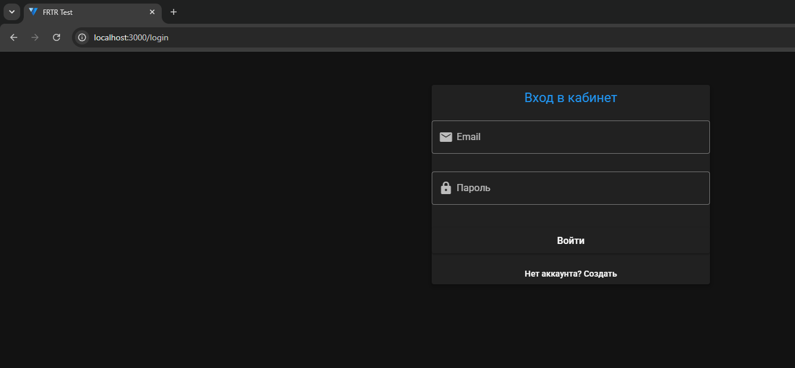
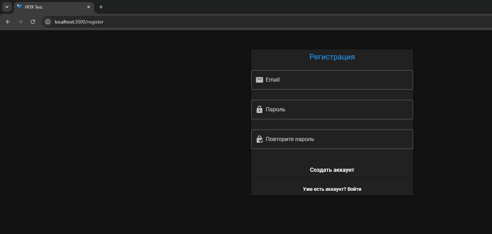
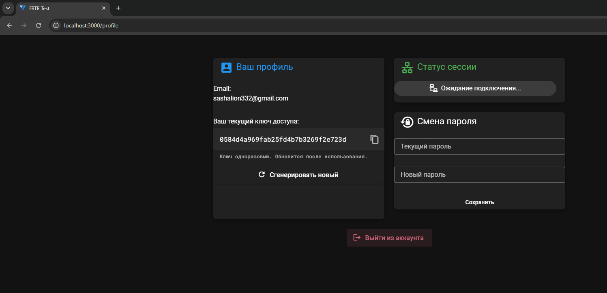
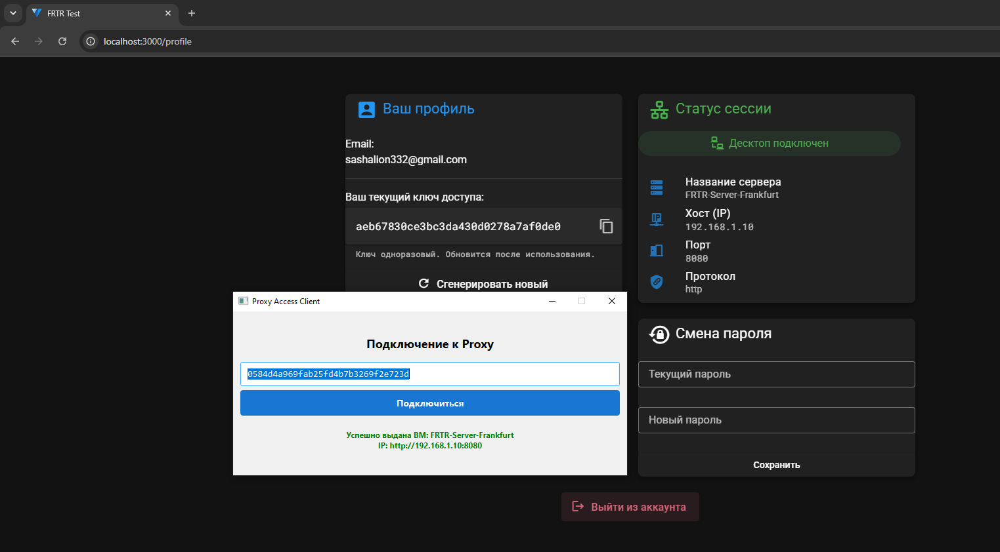

# FRTR Test

Данный репозиторий содержит реализацию тестового задания. Проект представляет собой комплексное клиент-серверное решение для выдачи, управления и мониторинга доступа к прокси-серверам (виртуальным машинам). Архитектура состоит из асинхронного REST API, веб-кабинета пользователя и десктопного приложения.

В качестве основного стека технологий используются FastAPI, SQLAlchemy (async) и PostgreSQL для бэкенда; Celery и Redis для выполнения фоновых задач; Vue 3 с Vuetify для фронтенда; Python и PyQt6 для десктопного клиента. Вся серверная инфраструктура упакована в Docker и Docker Compose. Обмен статусами в реальном времени реализован через WebSockets.

## Логика работы и архитектура

Бизнес-логика системы построена вокруг безопасного распределения пула виртуальных машин (ВМ) по одноразовым ключам доступа. После регистрации через веб-интерфейс пользователь получает на почту уникальный ключ. При вводе этого ключа в десктопном приложении сервер производит проверку: если ключ действителен и у пользователя еще нет активной сессии, ему выделяется свободная ВМ. При успешной выдаче старый ключ инвалидируется, а десктопному клиенту отправляется новый ключ, который в дальнейшем используется исключительно для корректного отключения и освобождения ВМ.

Статус подключения и параметры выделенного сервера мгновенно отображаются в личном кабинете пользователя благодаря WebSocket-соединению. Сервер строго контролирует, чтобы один пользователь не мог занять несколько машин одновременно — такие запросы будут отклонены.

Также предусмотрен механизм аварийного сброса. Если десктопный клиент был закрыт некорректно или произошел сбой сети, сессия может остаться активной на стороне сервера. В таком случае пользователь может нажать кнопку "Сгенерировать новый ключ" в личном кабинете. Это действие принудительно отвяжет занятую виртуальную машину, завершит старую сессию и отправит на почту новый ключ для подключения.

## Требования и запуск

Для корректного запуска проекта на вашей машине должен быть установлен Docker и плагин Docker Compose.

Перед стартом необходимо настроить переменные окружения. Скопируйте файл `.env.example` и переименуйте его в `.env`. Внутри укажите актуальные данные вашего SMTP-сервера (Email и пароль приложения). Эти данные необходимы для работы фоновых задач Celery, которые отправляют пользователям письма с одноразовыми ключами доступа при регистрации или их сбросе.

Для запуска всей инфраструктуры выполните в корневой директории проекта следующую команду:

```bash
docker-compose up -d --build
```

После успешной сборки и старта контейнеров веб-интерфейс (Личный кабинет) будет доступен по адресу `http://localhost:3000`. Вы можете перейти туда через браузер для проверки работы сайта. Серверный API будет работать на `http://localhost:8000`, а документация Swagger — на `http://localhost:8000/docs`.

Десктопный клиент запускается локально. Для этого перейдите в папку `desktop`, установите зависимости командой `pip install -r requirements.txt` и запустите файл `main.py`.

## Тестирование

Бэкенд покрыт асинхронными автотестами с использованием pytest и httpx. Тесты развернуты в изолированном Event Loop и включают сценарии регистрации, авторизации (в том числе проверку валидации данных и обработку неверных паролей), управление профилем, а также полный цикл логики десктопного клиента (Desktop Flow). Проверяется корректная выдача ВМ, защита от повторного использования ключа и корректное освобождение ресурсов.

Для запуска автотестов выполните следующую команду внутри запущенного контейнера бэкенда:

```bash
docker exec -it proxy_backend pytest
```
## Пример открытого сайта
<p align="center">
  
  
  
  
</p>
